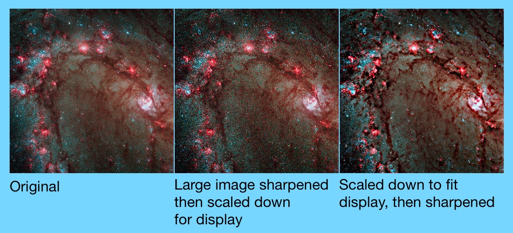

# SwiftUICoreImage

Help for using Core Image within the context of SwiftUI. Also useful even without SwiftUI.

## Introduction

Core Image is a wonderful image-processsing toolkit in macOS and iOS, but it's a bit clunky to use. Even after Apple added Swift APIs to many of the filters ([CoreImage.CIFilterBuiltins](https://developer.apple.com/documentation/coreimage/methods_and_protocols_for_filter_creation)), it's still pretty tedious to chain filters to images.

The purpose of this package is to provide an easier way to chain multiple filters to CIImage instances and then render them into SwiftUI (or any other context — SwiftUI is not needed).

```Swift
    Image(ciImage: CIImage("Bernie.jpeg")
        .sepiaTone(intensity: sepia)
        .recropping { image in
            image
                .clampedToExtent(active: clamped)
                .gaussianBlur(radius: gaussianBlurRadius)
        }
    )
        .resizable()
        .aspectRatio(contentMode: .fit)
```

## Manifest

Included in this package is:

 * CIImage+Generated.swift
    * 208 modifiers on `CIImage` that return a new modified `CIImage` (or the original if unmodified)
    * 20 static functions that return a newly generated `CIImage`
* CIImage-Extensions.swift
    * Convenience initializers for `CIImage` from a resource name and from an `NSImage`/`UIImage`
    * Modifiers for `CIImage` to return cropped, scaled, etc. to be easier to work with SwiftUI
    * Overloads of several built-in `CIImage` modifier functions that take an `active` boolean parameter
* Image-Extensions.swift
    * Convenience initializer to create a SwiftUI `Image` from a `CIImage`

## How This Works

Similarly to how SwiftUI view modifiers each return a modified `View` instance, these modifiers on `CIImage` take care of the core image chaining by creating a corresponding `CIFilter`, hooking up the `inputImage` for you, and returning the resulting `outputImage`. 

When creating SwiftUI code, I think it's important that you can use [Inert Modifiers](https://developer.apple.com/videos/play/wwdc2021/10022/?time=2303) in which you pass in some parameter that causes the modifier to have no effect. (For instance, specifying opacity of 1.0 or padding of 0.0 to a view.)  

In this code, I've made sure that each of our image modifiers come with inert modifiers: in some cases it's passing in a parameter that clearly has no effect (e.g. zero intensity, zero radius); or it's a nil background image when combining with another image; or a boolean `active` parameter. If the parameter(s) specified would cause no change in the image, then the identity (self) is returned forthwith.

The contents of CIImage+Generated.swift are, not surprisingly, generated source code, using code that I've included in this repository (but won't be included in the package import). This loops through the core image metadata that Apple provides (`CIFilter.filterNames(inCategories: nil)`). Unfortunately this list is somewhat out of date and contains a number of inconsistencies that I've done by best to overcome.  There are some JSON files that provide additional metadata such as a list of the functions that actually do have online documentation — 56 functions aren't documented so some guesswork is needed — or repairs to missing or obsolete documentation. You probably won't need to run this code unless you have some special requirements or the list has been updated in a future (post-Ventura, post iOS-16) OS release.

## Using With SwiftUI

Remember that Core Image operations are really just a "recipe" for the processing steps; the actual work is not performed until the image needs to be rendered to a bitmap. 

Instead of creating a SwiftUI `Image` using a [built-in initializer](https://developer.apple.com/documentation/swiftui/image) from a resource name or other image type (`CGImage`, `NSImage`, `UIImage`), this code provides a new initializer to create an `Image` from a `CIImage`. When SwiftUI needs to render the image, the Core Image is rendered to the screen.

So instead, we create a CIImage using one of the [built-in initializers](https://developer.apple.com/documentation/coreimage/ciimage) or the convenience methods included here to create from a resource name or another image type.

Then, just chain modifiers to that `CIImage` to indicate what to modify.

Many modifiers are simple. For instance:

```Swift
    Image(ciImage: CIImage("Halloween.jpeg")
        .xRay()
    )
```

If you wish to toggle whether the filter is applied, use the `active` parameter (default value of `true`):

```Swift
    Image(ciImage: CIImage("Halloween.jpeg")
        .xRay(active: isMachineOn)
    )
```

### Image Scaling

Many Core Image filters need pixel values for parameters. Therefore, it may be needed to get an image scaled to an appropriate size before applying operations. For example, applying a 10-pixel-radius blur to a 6000✖4000 image that is then scaled down to 300✖200 won't look the same as first scaling the image to 300✖200 and then applying the 10-pixel-radius blur.

Core Image provides a scaling operation (`CILanczosScaleTransform` and `lanczosScaleTransform()`) but this package also includes more convenient alternatives: `scaledToFill()` and `scaledToFit()`.

A typical use of this works well in conjunction with `GeometryReader`. For example:

```Swift
    GeometryReader { geo in
        let geoFrame = geo.frame(in: .local)
        // Resize image to double the frame size, assuming we are on a retina display
        let newSize: CGSize = CGSize(width: geoFrame.integral.size.width * 2,
                                    height: geoFrame.integral.size.height * 2)

        Image(ciImage: CIImage("M83.jpeg")
            .scaledToFit(newSize)
            .sharpenLuminance(sharpness: 1.0, radius: 5)
        )
            .resizable()    // Make sure retina image is scaled to fit
            .aspectRatio(contentMode: .fit)
    }
``` 



## Using Without SwiftUI

SwiftUI is not needed at all. Just create a `CIImage` and perform operations. Then, render to a bitmap.

```Swift
    let tiledImage: CIImage = CIImage("HeyGoodMorning.png").
        .triangleTile(center: .zero, angle: 0.356, width: 2.0)

    imageView.image = UIImage(CIImage: tiledImage)
```

## Other Notes

If you've used Core Image, you'll know that sometimes you need to play with the extent of an image, e.g. clamping an image to have infinite edges before applying a gaussian blur, then re-cropping to the image's original extent. To accomplish this, you can use the **`recropping`** modifier which is followed by a closure. The operation saves the extent of the image, applies whatever is in the closure, and then re-crops to that extent. In the example below, the image in `ciImage` is converted into an image with the pixel colors along its edges extend infinitely in all directions, then it is blurred, and then upon exit from the closure, the returned image is re-cropped. 

```Swift
    ciImage
        .recropping { image in
            image
                .clampedToExtent()
                .gaussianBlur(radius: 10)
        }
```


The `recropping` modifier is also useful if you find that the filter has grown your image's extent slightly and you want to clamp it to its original size.

Another useful operation is **`replacing`**. Much like `recropping` except that it does not mess with the extent of the image. You pass in a closure, which starts with the image you were working with; your closure returns a new image. This can be useful when working with the compositing operations in Core Image, which require a *background* image to be passed in.  What if your chain of operations is on the background image, and you want to overlay something on top? Just wrap your operation in `.replacing` and return the composited image.

```Swift
    ciImage
        .replacing { backgroundImage in
            ciImage2
                .sourceAtopCompositing(backgroundImage: backgroundImage)
        }
```

In this case, the image in `ciImage2` is the foreground image, placed atop the `backgroundImage`, then returned to the chain of operations.


